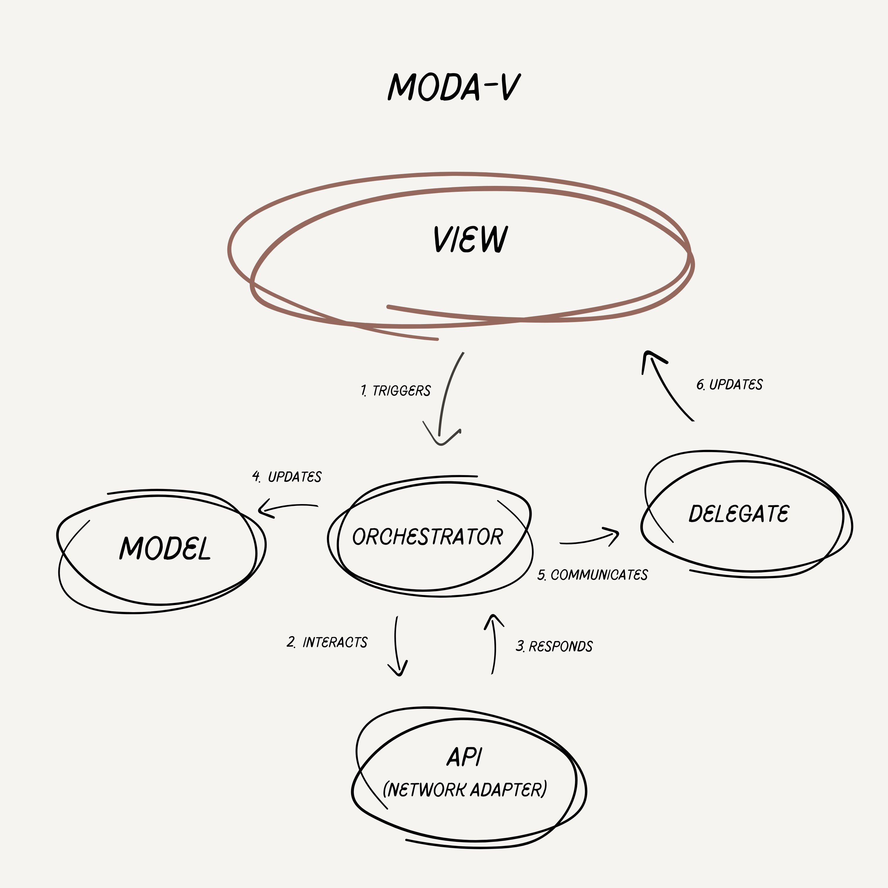
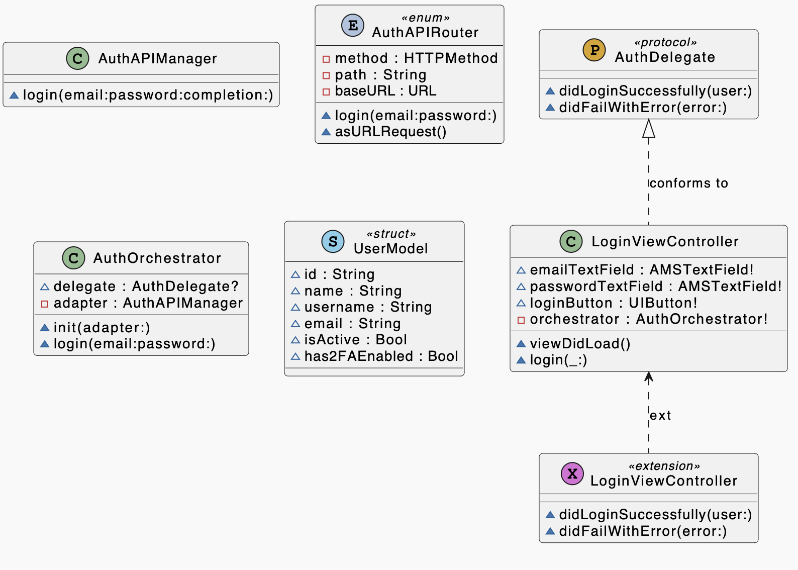
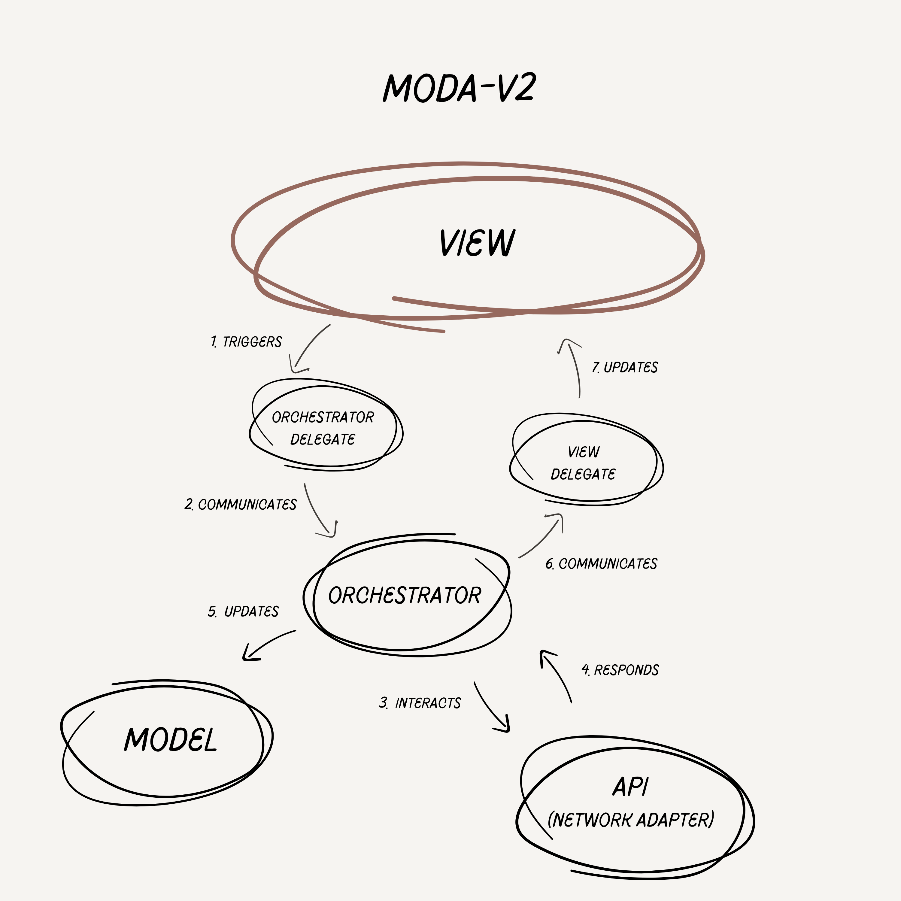

# MODA-V Software Architecture Framework
**MODA-V _(Model-Orchestrator-Delegate-Adapter-View)_** is a Software Architecture Framework mainly focused for Mobile Development. It emphasizes modularity, separation of concerns, testability, and maintainability.


## Introducing MODA-V: Revolutionizing Software Architecture

Welcome to MODA-V (Model-Orchestrator-Delegate-Adapter-View), a groundbreaking architectural framework designed to transform the landscape of software development. If you're a developer seeking an architecture that harmoniously combines simplicity, modularity, and scalability, MODA-V is your gateway to a new era of coding efficiency.

Born out of the necessity to transcend the limitations of traditional architectures like MVC, MVP, MVVM, and VIPER, MODA-V stands out with its unique approach to component interaction and responsibility division. It is a pattern that respects the intricacies of modern software development while ensuring your code remains agile, maintainable, and testable - regardless of the scale and complexity of your project.

MODA-V's genius lies in its clear separation of concerns, where each component has a distinct, well-defined role. This not only makes your codebase more intuitive and easier to navigate but also significantly enhances the development experience by simplifying both unit and integration testing. Whether you're developing a web service, a desktop application, or venturing into the realm of mobile apps, MODA-V's adaptable structure seamlessly fits your project's needs.

Step into the world of MODA-V, and prepare to experience software architecture that aligns with the dynamic demands of today's development environment. Embrace a framework that not only addresses current challenges but is also geared towards future advancements. MODA-V is not just a new architecture; it's a new way of thinking about software design.

## Components
- **Model:** Represents the data and business logic of the application.
- **Orchestrator:** Manages application logic, orchestrating interactions between the Model, View, Adapter, and Delegate.
- **Delegate:** Protocol for View-Orchestrator communication, allowing decoupled and testable interactions.
- **API (Network Adapter):** Handles external interactions, like network requests or database access, abstracting these details from the Orchestrator.
- **View:** User interface component, typically a ViewController in iOS, responsible for displaying data and capturing user inputs.


## Principles of MODA-V

### 1. Separation of Concerns

- **Distinct Responsibilities:** Each component in MODA-V - Model, Orchestrator, Delegate, Adapter, and View - has a specific role. This clarity prevents the overlapping of responsibilities that can lead to convoluted code.
- **Enhanced Code Clarity and Maintenance:** By keeping different aspects of the application (logic, UI, external interactions) separate, the codebase becomes more intuitive and easier to maintain.
- **Avoiding Overloaded Components:** Unlike patterns where components like Controllers (MVC) or ViewModels (MVVM) can become bloated, MODA-V maintains lean and focused components, reducing the risk of “monolithic components”

### 2. Modularity
- **Independent Development and Testing:** Components can be developed, tested, and modified independently. This modularity facilitates parallel development and simplifies updates.
- **Reusable Components:** The modular nature of MODA-V allows components, especially Adapters and Delegates, to be reusable across different parts of the application or even in different projects.
- **Facilitating Team Collaboration:** Modularity makes it easier for teams to work on different parts of the application simultaneously without significant merge conflicts or dependencies.

### 3. Scalability
- **Adaptable to Application Size:** MODA-V works well for both small-scale applications and large-scale projects. Its structure can be as lightweight or as comprehensive as the project demands.
- **Handling Growing Complexity:** As applications grow and evolve, MODA-V’s clear structure helps manage increasing complexity without major architectural overhauls.
- **Flexibility for Future Expansion:** New components, such as additional Adapters or Delegates, can be integrated seamlessly as the application scales.

### 4. Testability
- **Easier Unit Testing:** The decoupling of components in MODA-V simplifies unit testing. Each part of the architecture can be tested in isolation (e.g., testing Adapters without Orchestrators).
- **Simplified Mocking and Stubbing:** It's easier to mock dependencies for each component, such as mocking network responses for Adapters or user interactions for the View.
- **Enhanced Integration Testing:** The clear interfaces between components also simplify integration testing, as the interaction points are well-defined and consistent.

In summary, the principles of MODA-V focus on creating a structured, maintainable, and flexible architecture that is suitable for a wide range of application sizes and complexities. Its emphasis on separation of concerns and modularity enhances both the development process and the quality of the final product, making it a robust choice for iOS application development.


## Workflow

The workflow of MODA-V architecture is akin to a well-orchestrated symphony, where each component plays its part in perfect harmony. It's a dance of Model, Orchestrator, Delegate, Adapter, and View, each with its distinct role, yet seamlessly interconnected. This elegant choreography ensures that from the initial user interaction to the final display of data, every step is clear, efficient, and purposeful. As you delve into the MODA-V workflow, prepare to witness a streamlined process that not only simplifies development but also elevates it to new heights of clarity and efficiency.



### 1. View Triggers Orchestrator
The user interacts with the View (e.g., LoginViewController), such as entering login credentials and tapping the login button.
The View directly calls a method on the Orchestrator (e.g., LoginOrchestrator) to handle this action. There's no intermediary; the View has a direct reference to the Orchestrator.
```
// In LoginViewController
orchestrator.performLogin(email: emailTextField.text, password: passwordTextField.text)
```

### 2. Orchestrator Processes the Request & Interacts with the API (Network Adapter)
The Orchestrator processes the request. It contains the logic to decide what to do with the user's input. In this case, it needs to validate the credentials.
The Orchestrator uses the Adapter (e.g., NetworkAdapter) to make a network request, abstracting away the details of how the request is made.

### 3. Adapter Handles External Communication
The Adapter performs the network request, dealing with server communication, and returns the result (success or failure) to the Orchestrator.

### 4. Orchestrator Updates the Model
Upon receiving the response, the Orchestrator updates the Model if necessary (e.g., storing user data) and decides how to respond to the View.

### 5. Orchestrator Communicates Back to the View via Delegate
The Orchestrator communicates the outcome (e.g., success or error) back to the View using the Delegate protocol. This allows for a decoupled design where the View doesn't need to know about the business logic or network operations.
```
// Orchestrator to View via Delegate
viewDelegate?.loginSucceeded(user: user)
// or
viewDelegate?.loginFailed(error: error)
```

### 6. View Updates Based on Delegate Feedback
Finally, the View updates its state or UI based on the feedback from the Orchestrator. This could involve displaying error messages, updating UI elements, or navigating to a new screen.

### Summary of Workflow:
- **User Interaction:** Initiated in the View.
- **Business Logic:** Handled by the Orchestrator.
- **External Communication:** Managed by the Adapter.
- **Feedback to View:** Provided through a Delegate protocol, keeping the Orchestrator and View decoupled.

This flow ensures that each component in MODA-V has a clear responsibility and interacts with others in a structured and predictable manner, promoting clean architecture and facilitating easier maintenance and testing.



### MODA-V2 Workflow



The direct interaction between the View and Orchestrator is a standout feature, providing a straightforward and intuitive process, ideal for simpler scenarios where ease of implementation takes center stage. This approach ensures clarity and reduces complexity, making it particularly appealing for projects where quick development and simplicity are key.

However, MODA-V also excels in managing more complex scenarios with its alternate modular approach. By having the Orchestrator conform to a protocol, the architecture gains an extra layer of abstraction. This not only fosters a loosely coupled system but also significantly boosts flexibility and scalability. In such a setup, modifying or extending the application becomes more straightforward, without necessitating extensive changes in the View. This model is especially advantageous for larger-scale projects or environments where adaptability, extensive testing, and future-proofing are paramount.

In essence, the MODA-V workflow presents a dual-faceted approach - direct and protocol-based interactions - each catering to different project needs while upholding the principles of clean architecture. Whether you are building a compact app or a complex system, MODA-V adapts to your requirements, ensuring that your development journey is both efficient and enjoyable.

### 1. View Triggers Orchestrator Through View Delegate
The flow begins in the View (e.g., LoginViewController), where the user interacts with the interface, such as entering their credentials and tapping the login button.
The View communicates these actions to the Orchestrator (e.g., LoginOrchestrator) through a Delegate method. The View does not process the data itself; it merely forwards the user input.
```
// In LoginViewController
orchestrator.performLogin(email: emailTextField.text, password: passwordTextField.text)
```

### 2. Orchestrator Processes the Request & Interacts with the API (Network Adapter)
The Orchestrator processes the request. It contains the logic to decide what to do with the user's input. In this case, it needs to validate the credentials.
The Orchestrator uses the Adapter (e.g., NetworkAdapter) to make a network request, abstracting away the details of how the request is made.

### 3. Adapter Handles External Communication
The Adapter performs the network request, dealing with server communication, and returns the result (success or failure) to the Orchestrator.

### 4. Orchestrator Updates the Model
Upon receiving the response, the Orchestrator updates the Model if necessary (e.g., storing user data) and decides how to respond to the View.

### 5. Orchestrator Communicates Back to the View via Delegate
The Orchestrator communicates the outcome (e.g., success or error) back to the View using the Delegate protocol. This allows for a decoupled design where the View doesn't need to know about the business logic or network operations.
```
// Orchestrator to View via Delegate
viewDelegate?.loginSucceeded(user: user)
// or
viewDelegate?.loginFailed(error: error)
```

### 6. View Updates Based on Delegate Feedback
Finally, the View updates its state or UI based on the feedback from the Orchestrator. This could involve displaying error messages, updating UI elements, or navigating to a new screen.

### Summary of Workflow:
The workflow remains mostly unchanged; however, the key difference lies in the communication method between the View and the Orchestrator. Instead of direct interaction, this process is facilitated through a Delegate (protocol). This modification leads to a more modular system with loose coupling, enhancing both flexibility and scalability.

# Comparing MODA-V to ...

_Clarification Note:_
_In each Architectural Framework that is compared, Pros are listed the Pros of MODA-V towards that specific Framework, and same is done for Cons too._

## MVC (Model-View-Controller)

**🔀 Differences:**
- **Role of Orchestrator vs. Controller:** In MODA-V, the Orchestrator handles business logic and decision-making, typically more focused than the Controller in MVC, which often ends up managing both business logic and view logic.
- **Adapter Component:** MODA-V explicitly includes Adapters for handling external interactions (like network requests), which is a task often absorbed by the Controller in MVC.

**✅ Pros:**
- **Better Separation of Concerns:** Avoids the "Massive View Controller" problem common in MVC.
- **Modularity:** Easier to maintain and test due to more focused components.

**👎 Cons:**
- **Complexity:** MODA-V might be more complex to implement than MVC, especially for simple applications.


## MVP (Model-View-Presenter)

**🔀 Differences:**
- **Delegate Role:** MODA-V uses a Delegate for View-Orchestrator communication, which might be more flexible compared to the direct View-Presenter coupling in MVP.
- **External Interactions:** Explicit handling of external interactions through Adapters in MODA-V, while in MVP, this is often managed within the Presenter.

**✅ Pros:**
- **Decoupling of View and Logic:** Enhanced testability and maintainability.
- **Focused Presenter (Orchestrator):** Reduces the risk of an overloaded Presenter.

**👎 Cons:**
- **Implementation Overhead:** Slightly more complex to set up due to the additional Adapter component.


## MVVM (Model-View-ViewModel)

**🔀 Differences:**
- **Delegate for Communication:** MODA-V uses Delegates for communication between the View and Orchestrator, contrasting with MVVM's data binding approach.
- **Explicit External Interaction Handling:** MVVM often handles external interactions within the ViewModel, while MODA-V uses separate Adapters.

**✅ Pros:**
- **Improved Testability:** Easier to mock and test each component due to clear separation.
- **Flexibility in UI Updates:** Delegate pattern can offer more control over UI updates compared to data binding.
- **Modularization of View:** In MODA-V, the View can be more easily modularized. This separation enhances the maintainability and scalability of the components. Unlike MVVM, where the ViewModel can sometimes become tightly coupled with the View due to data binding, MODA-V's use of a Delegate pattern allows for a more distinct separation. This separation facilitates the independent development and testing of the View and Orchestrator, making the architecture more adaptable to changes in the user interface or business logic.

**👎 Cons:**
- **Less Reactive:** Without data binding, the reactive nature of MVVM is not inherent in MODA-V.


## VIPER (View-Interactor-Presenter-Entity-Router)

**🔀 Differences:**
- **Simpler Structure:** MODA-V is generally simpler than VIPER, which has very defined and numerous roles for each component.
- **Router vs. Adapter:** VIPER includes a Router for navigation, whereas MODA-V's Adapter is more focused on external interactions.

**✅ Pros:**
- **Less Overwhelming for Smaller Projects:** MODA-V is easier to grasp and implement than the more granular VIPER architecture, making it more accessible for new developers.
- **Flexibility:** MODA-V offers a balance between structured organization and flexibility.

**👎 Cons:**
- **Navigation Handling:** Lacks a dedicated component for navigation management, which is explicitly addressed in VIPER.

# General Pros and Cons of MODA-V

### Pros:

- **Focused Components:** Each part of the architecture has a clear and defined role.
- **Modularity and Testability:** Components can be easily tested in isolation.
- **Scalability:** Suitable for both small and large applications.
- **Easier Adaptability for Existing Codebases:** Due to its structured yet flexible nature, integrating MODA-V into an existing project may be more straightforward compared to more rigid architectures. This adaptability makes it suitable for evolving projects that need to shift from a less structured architecture like MVC.
- **Enhanced Focus on External Interactions:** The distinct Adapter component in MODA-V specifically addresses the handling of external interactions (like network requests, database access, etc.). This focus can lead to cleaner and more manageable code for handling these interactions, as opposed to architectures where this responsibility might be diffused or overloaded in other components.


### Cons:

- **Learning Curve:** New architecture to learn and understand.
- **Potentially Overengineered for Simple Apps:** For very basic applications, the structure might be more complex than necessary.

### Summary:
In summary, MODA-V offers a balanced approach, aiming to provide clear separation of concerns and modularity while avoiding the complexity of architectures like VIPER. It's suitable for applications that need a structured approach but find MVP or MVVM too limiting or VIPER too complex.


## Usage Guidelines for MODA-V

### 1. Component Interactions

- **Defining Clear Interfaces:** Establish well-defined protocols or interfaces for communication between components (e.g., between View and Orchestrator, Orchestrator and Adapter). This clarifies expectations and responsibilities.
- **Event-Driven Interactions:** Utilize events or delegate methods for communication, especially from the View to the Orchestrator, ensuring that the View remains agnostic of the business logic.
- **Flexible Interaction Models in MODA-V Architecture:** MODA-V framework offers two distinct interaction models between the View and the Orchestrator. In the first model (the one we explained till now and took examples), the View directly interacts with the Orchestrator, facilitating a straightforward and easy-to-follow structure. This is suitable for simpler scenarios where ease of implementation is a priority. Alternatively, for more complex scenarios, we can adopt a modular and loosely coupled approach by introducing a protocol. In this second model, the Orchestrator conforms to a protocol, allowing the View to interact with it in a more abstract manner. This method enhances flexibility and scalability, making it easier to modify or extend the system without significant changes to the View. It's particularly beneficial for larger projects or situations where testing and adaptability are crucial. Both models emphasize efficient and practical interaction between components, with the choice depending on the specific needs and complexity of the project within the MODA-V framework.

### 2. State Management

- **Centralizing State in Orchestrator/Model:** Manage the application's state within the Orchestrator and Model. This might include user data, application status, and so on.
- **Avoiding Stateful Views:** Keep Views stateless as much as possible. Any state necessary for the UI should be transient and derived from the state in the Orchestrator or Model.
- **Synchronizing State Across Components:** Ensure that any state changes in the Model are accurately and timely reflected in the View through the Orchestrator, maintaining consistency across the application.

### 3. Error Handling

- **Robust Error Management in Orchestrator:** Implement comprehensive error handling within the Orchestrator. This includes handling errors from Adapters (e.g., network errors) and any internal logic errors.
- **User-Friendly Error Reporting:** Translate technical errors into user-friendly messages or indicators. The Orchestrator should send these user-centric messages to the View, which will display them appropriately.
- **Consistency in Error Responses:** Maintain a consistent strategy for error reporting across the application, making it easier for users to understand and for developers to maintain.

### 4. Networking and Data Persistence

- **Separation of Concerns in Adapters:** Handle all networking and data persistence operations in Adapters. This includes API calls, database interactions, and any other external data operations.
- **Abstraction of External Interactions:** Adapters should abstract the complexity of networking and data storage, providing a clean and simple interface for the Orchestrator to interact with.
- **Decoupling from Core Logic:** By isolating these operations in Adapters, the core application logic in the Orchestrator remains unaffected by changes in data sources or networking protocols, enhancing the application's adaptability and maintainability.


# About me

Hi there! I'm Emin, the architect of the MODA-V framework. As an experienced iOS Developer and Mobile Team Lead, I've always been passionate about pushing the boundaries in software architecture. Crafting MODA-V has been a journey of combining my years of experience in iOS development with my enthusiasm for building scalable and adaptable mobile applications. I love connecting with fellow developers and enthusiasts in the tech world, so feel free to reach out to me on [LinkedIn](https://www.linkedin.com/in/eminemini/) for any professional discussions or collaborations. Also, I often share my insights and experiences in software development on [Medium](https://eminemini.medium.com), and I'd be thrilled if you checked out my articles there.

Let's connect and explore the exciting world of technology together! 🚀

[www.eminemini.com](https://eminemini.com)
